# vLLM Serving Performance Analysis: Phase-Level Measurement of Prefill and Decode

Issei Hasegawa — Allegheny College
Repository: https://github.com/IsseiHasegawa/vLLM-experiment

<!--
TARGET: 6-8 pages. Budget per section is noted in each heading comment.
FIGURE NUMBERING is by document order, not by filename. Source file is noted at each slot.
MARKERS (written without comment delimiters here, since HTML comments cannot nest):
  `TODO` = must fix before submission
WRITING ORDER: 3 -> 4 -> 5 -> 6 -> 1 -> Abstract -> 2
-->

## Abstract

<!-- BUDGET 0.2p / ~150 words. Write LAST.
Contents: what was measured, three headline numbers, one-sentence conclusion. -->

Inference with a large language model splits into a prefill phase and a decode phase, and recent serving systems treat that split as a design premise. What operators observe, however, is aggregated: a latency figure carries no indication of which phase produced it, or whether the cost lay in phase computation at all. This report forks vLLM, instruments three files so that the per-phase timestamps the engine already computes are written out on a request axis and a step axis independently, and reports 232 measured runs across arrival rate, dataset, model size, GPU count and parallelism strategy.

Three findings follow from the separation. First, load does not appear where an aggregate would suggest: mean scheduler queue dwell never exceeds 0.021 ms at any finite rate of the ShareGPT sweep because vLLM admits waiting requests into the running batch at the next scheduling step rather than holding them, so load appears as batch growth, achieved throughput is a weak saturation signal and capacity is better read from a closed-loop curve — here 711 tok/s, or about 3.7 req/s. Second, the client's wait is not the server's computation: 38 % of observed TTFT falls outside prefill on the 7B model at rate 5 and 48–71 % on the 0.5B, and prefill itself never exceeds 2 % of end-to-end time at any finite rate. Third, parallelism is phase-selective. Tensor parallelism shortens decode-only steps 1.80× but prefill-carrying steps only 1.26×, and the step-axis log locates the mechanism: batch size is unchanged and the KV cache sits at 2.13 % utilization, while memory-controller utilization falls from 93.6 % to 39.5 % as shards are added. Holding the device count at two and changing only the strategy separates the throughput outcome while leaving the TTFT improvement comparable — pipeline parallelism converts none of the second GPU into throughput (−0.3 %, t = −0.43 over 23 seed-matched points) yet reduces TTFT p95 as much as tensor parallelism does (−12.0 % against −10.0 %).

The limiting resource is not fixed. On the 7B model the memory controller is busy 94 % of the time while the server-side process group uses under half a core; on the 0.5B model the GPU sits half idle while that group peaks at 144 % of one core. For small models the serving layer, rather than the model, appears to set the limit.

## 1. Introduction

<!-- BUDGET 0.8p. Write after section 5 is finished. -->

<!-- Paragraph 1: why serving-system performance is measured per phase at all. -->

<!-- Paragraph 3: the research questions. These map 1:1 onto 4.1-4.4 and onto section 7. -->

Inference with a large language model consists of two phases of different character: prefill, which processes the entire prompt at once, and decode, which produces one token per step. The distinction has become a premise of recent serving-system design, to the point that some systems place the two phases on separate device pools [@Zhong2024; @Patel2024]. What an operator sees, however, is an aggregate — a TTFT figure, a throughput number. When an aggregate degrades, nothing in it distinguishes a prefill problem from a decode problem, or either from a fixed cost in the serving layer that is not phase computation at all. Measuring per phase removes that ambiguity. And if the two phases are limited by different resources, then which remedy applies — adding GPUs, using a smaller model, changing the parallelism strategy — cannot be decided without separating them.

This report forks vLLM, adds instrumentation to three files, and reports 232 measured runs on the resulting build. The instrumentation does not introduce a new timer: it writes out the per-phase timestamps that vLLM V1 already computes internally, as JSONL. It records the request axis and the step axis independently, and samples GPU counters and per-process CPU once per second from outside the server process. A phase is an attribute of a request while a step is a batch that mixes both phases, so neither axis alone can separate time and resource usage by phase. The measurements span four sessions and cross five factors: arrival rate, dataset, model size, GPU count and parallelism strategy. Every condition in the comparison groups was repeated three times with a seed set held common across conditions; the single capacity probe P0 is the exception, and one G1 condition rests on two repetitions after a failed run (§3.3). The comparability of measurements taken in different sessions was checked with an anchor condition, and the cost of the instrumentation itself was checked by a control experiment.

**RQ1.** As the request arrival rate increases, how do per-phase latency and throughput change, and where and in what form does the capacity limit appear?

**RQ2.** How do workload characteristics (dataset, input/output ratio) and model size change capacity and phase composition?

**RQ3.** How large is the gain from additional GPUs and parallelism strategy, and to which phase is that gain attributable?

**RQ4.** Which resource determines the limits observed above?

## 2. Background & Related Work

<!-- BUDGET 0.8p total. Write LAST. -->

### 2.1 Prefill and decode

<!-- ~0.3p. Minimum needed to read the results: two-phase structure, KV cache,
     continuous batching, chunked prefill, and the metric mapping
     (TTFT <-> prefill, TPOT/ITL <-> decode). Cite Vaswani, Orca, vLLM, Sarathi-Serve. -->

Inference with an autoregressive Transformer splits into two phases of different character [@Vaswani2017]. Prefill processes the entire prompt at once and writes the key and value tensors of every layer into the KV cache. Decode then reads that cache and produces one token per step. This asymmetry is what the present report measures: a prefill step handles hundreds to over a thousand tokens, while a decode step advances each request by exactly one.

Serving systems layer two mechanisms on top of this structure. Continuous batching replaces completed requests with new arrivals without waiting for the whole batch to finish [@Yu2022]. PagedAttention divides the KV cache into fixed-size blocks and manages them through a mapping table, in the manner of virtual memory, which contains fragmentation [@Kwon2023]; vLLM, the system measured here, implements that mechanism. Chunked prefill goes further and splits a long prompt's prefill so that its pieces share an engine step with requests that are decoding [@Agrawal2024a]. This is on by default in vLLM V1, and the consequence is that a single engine step can contain requests in both phases. A phase is an attribute of a request; a step is a unit of batching. That difference in granularity is the reason the instrumentation in §3.1 uses two axes.

Client-side metrics map onto the phases, though not exactly. TTFT (time to first token) reflects the weight of prefill, while TPOT (time per output token) and ITL (inter-token latency) reflect the speed of decode. TTFT, however, also contains queueing, HTTP transfer and tokenization, none of which is phase computation. Separating that difference is the subject of §4.2.

### 2.2 Related work

<!-- ~0.5p. One paragraph. One-line attribution per citation; do not summarise papers.
     Order: Orca (continuous batching) -> vLLM/PagedAttention (the system measured here)
     -> Sarathi-Serve (chunked prefill) -> DistServe, Splitwise (phase asymmetry as a
     design premise) -> Megatron-LM (tensor parallelism) -> DUCHESS, HACK (Yu group).
     Close by stating what is NOT covered by prior work: an end-to-end phase-level
     measurement across all five factors on a single instrumented build. -->

Since Orca introduced continuous batching [@Yu2022], work on LLM serving has been concerned with holding throughput and latency together. vLLM [@Kwon2023] recast KV cache management as a virtual-memory problem and is the system measured here. Sarathi-Serve [@Agrawal2024a] addressed prefill stalling decode through chunked prefill and decode-maximal batching. DistServe [@Zhong2024] and Splitwise [@Patel2024] go further still and place the two phases on separate device pools. All of these accept the phase asymmetry as a design premise, but none takes as its subject the question of which resource that asymmetry comes from on a running server. On the parallelism side, Megatron-LM [@Shoeybi2019] established tensor parallelism and GPipe [@Huang2019] pipeline parallelism; both target training, and the phase-level effect of each at inference time is what this report measures. For classifying bottlenecks, the roofline model [@Williams2009] is the standard tool, and Yuan et al. [@Yuan2024] apply it layer by layer to LLM inference. On the evaluation side, Schroeder et al. [@Schroeder2006] showed that open-loop and closed-loop workload generation produce fundamentally different behaviour, and Etalon [@Agrawal2024b] systematizes metrics for LLM serving. From the Yu group, HACK [@Zhang2025] accelerates disaggregated inference by compressing the KV cache, and Jiang et al. [@Jiang2025] orchestrate reasoning branches within a request.

What this report addresses instead is the measurement itself. To our knowledge, no prior work records phase-level latency and resource utilization end to end across all five factors — arrival rate, dataset, model size, GPU count and parallelism strategy — on a single instrumented build. The effect of each individual mechanism has been established; what has not been done is to place them on one instrumentation and separate, phase by phase, which resource sets the limit.

## 3. Methodology

<!-- BUDGET 1.5p total across 3.1-3.5. -->

### 3.1 Instrumentation
For this measurement, we forked vLLM from GitHub (vllm-project/vllm, base commit 702f4814), made changes to three files totaling approximately 190 lines on the instrumentation branch, and then built it using an editable install from the source. Inference paths have never been changed except for instrumentation. The main purpose of this research is not optimization but measurement. All of these changes are intended to make the internal time readable from the outside. The fork, the instrumentation commit (019e5d1), and the buffered-flush commit (d4e0675) are available at github.com/IsseiHasegawa/vllm.

The design of the instrumentation is not to build a new timer, but to write out the value that vLLM V1 has already calculated. The V1 metrics layer retains the times for queuing, prefilling, and decoding for each request at the time FinishedRequestStats is constructed. By adopting an approach that outputs this data directly to JSONL without recalculating it, we minimized the risk of introducing bugs through custom code and, at the same time, enabled cross-validation with the Prometheus histograms published by vLLM itself.

The core of this design lies in dividing the instrumentation into two axes. In vLLM V1, chunked prefill is always enabled, and a single engine step contains a mix of requests undergoing prefill and requests undergoing decoding. In other words, phase refers to a request attribute, while step refers to a batch containing a mix of both phases. Since the two have different levels of granularity, relying on only one of them would not allow time and resource usage to be separated by phase. Therefore, we adopted a three-layer architecture that independently logs the request and step axes and samples resources from outside the process at 1 Hz (Figure 1).

| Layer | Output | Fields |
|:---------------|:----------------|:-------------------------------------------------------------|
| Request axis | `requests.jsonl` | `queued_s`, `prefill_s`, `decode_s`, `inference_s`, `e2e_s`, `n_prompt`, `n_gen`, `n_cached` |
| Step axis | `steps.jsonl` | `sched_s`, `exec_s`, `n_ctx_reqs`, `n_ctx_toks`, `n_gen_reqs`, `n_gen_toks`, `n_running`, `n_waiting`, `kv_usage` |
| Resource | external logger | GPU utilisation, memory-controller utilisation, VRAM and power per device, read from `nvidia-smi --query-gpu` at 1 Hz; aggregate CPU utilisation of the processes classified as server and as benchmark client (psutil) |

: Schema of the three instrumentation layers.

**Figure 1.** The three instrumentation layers. The benchmark client controls the
arrival rate; the instrumented fork writes one log on the request axis and one on
the step axis; an external process samples GPU counters and per-process CPU at 1 Hz.
The dashed arrow marks observation from outside the server process, so the resource
layer is independent of the code under measurement.

The definitions of each time period were adopted directly from the vLLM’s internal definitions. queued_s covers the period from the QUEUED event to the first SCHEDULED event. The QUEUED event is recorded inside Scheduler.add_request(), on the engine-core side, so queued_s measures dwell in the scheduler's waiting queue and excludes the HTTP frontend, tokenization and the frontend-to-engine IPC path; §4.2 quantifies what falls outside it. prefill_s covers the period from the first SCHEDULED event to the first token (including chunk segmentation and any waiting time in between); decode_s covers the period from the first token to the last token; and e2e_s covers the period from arrival at the front end to completion. Since the frontend and engine core are separate processes, the output destinations are also separated by process.

The logger is enabled only when the environment variable VLLM_PHASE_LOG_DIR is set; if it is not set, the function immediately returns at the beginning of the hook. Because instrumentation can be disabled without changing the binary, this enables the C1 control experiment described later (§3.5). Writing is performed via a buffer, and a background flush is scheduled every second to ensure that the last record is not lost in the event of a server crash.

The correctness of the instrumentation was verified through actual measurements. First, we verified the identity prefill_s + decode_s = inference_s—which should hold given the configuration—for all records, and then cross-checked the results against vLLM's own Prometheus histograms. In the initial validation on a 0.5B model, the queueing, prefill and decode means agreed exactly (1.07 ms, 25.43 ms and 714.32 ms against identical Prometheus values over 60 requests), but the step-level token accounting fell short of the request-level total, consistent with buffered records lost at shutdown. This motivated the background flush described above. After that change, the same battery on session B reproduced the Prometheus agreement (72.04 ms, 238.24 ms, 2135.56 ms) and the token accounting matched exactly: 6,400 prefill tokens and 3,150 decode tokens on both axes. Across the four measurement sessions the instrumentation wrote 51,808 request records and 756,661 step records. Each server boot window holds 51 request records — its 20 boot warm-up prompts, the harness's 30 warm-ups and one connectivity-test request; setting aside the nine test-request records from the nine instrumented boots, the per-session counts (20,440, 7,700, 18,089 and 5,570) each match the totals expected from the run composition exactly, confirming that no records were lost at shutdown. Session D contributes no step records, because pipeline parallelism forces an execution path the instrumentation does not hook (§3.3).

Additionally, we implemented two safeguards to ensure that the attribution of timing measurements remained unambiguous. First, there are two execution paths for vLLM steps: step and step_with_batch_queue; in the latter, execution overlaps with the next step. In this measurement, we explicitly disabled async scheduling and ensured that all runs in Sessions A–C followed the former path by having the patch log which path was selected at startup once. Pipeline parallelism (Session D) is the exception: its executor requires the batch-queue path, which the startup log records and which is why that session has no step-axis data. Second, we did not use the --disable-log-stats option. This is because phase timestamps are carried as EngineCoreEvents, and disabling statistics would cause the measurement targets themselves to disappear.

### 3.2 Workloads and datasets
For this measurement, we selected two datasets with contrasting characteristics. ShareGPT is a public dataset comprising actual interactions between humans and dialogue models, and the prompt lengths vary widely. random is a synthetic workload generated by the vLLM benchmark harness, where the input and output lengths can be fixed. We chose these two because, since the amount of work required for prefill depends on the prompt length, the distribution of prompt lengths itself becomes an independent variable. ShareGPT is realistic but uncontrollable, while random is unrealistic but fully controllable. The former provides external validity, while the latter provides internal validity.

ShareGPT used ShareGPT_V3_unfiltered_cleaned_split.json (672,837,942 bytes; first 16 digits of SHA-256 hash: 35f0e213ce091ed9). Distribution statistics were calculated using the Qwen2.5-7B-Instruct tokenizer, with 5,000 samples extracted using seed 42. The random workload used a default of 256 input and 128 output tokens, with range_ratio set to 0 to eliminate length variability. In groups I1 and I2, which isolate the effects of the input-to-output ratio, this fixed length was changed to 512/128 and 128/512, respectively.

The nominal and realised distributions differ substantially. The harness sampler admits a conversation only if its prompt and output are each at least 4 tokens, the prompt is at most 1,024 tokens, and prompt and output together are at most 2,048 (is_valid_sequence in vllm/benchmarks/datasets/datasets.py). The source file reaches 66,076 tokens, but the realised maximum is 1,010 — a consequence of this filter, not of the data. The summaries of both are shown side by side.

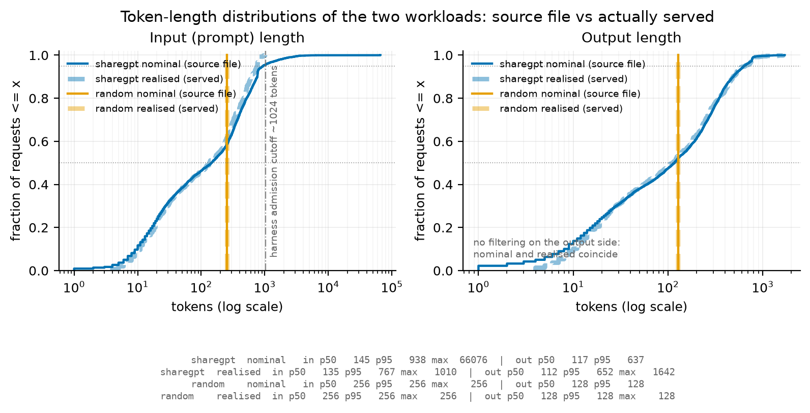

**Figure 2.** Cumulative distribution of prompt lengths for ShareGPT and random
(log x-axis). Solid lines are realised values taken from the phase logs; dashed
lines are nominal values from the source file. The divergence of the two ShareGPT
curves at 1,024 tokens is caused by the benchmark harness sampler, which does
not admit longer prompts. The random workload is fixed-length and therefore renders as a vertical step in the CDF.

| Dataset | Source | Input p50 | p95 | max |
|:---------|:-----------------------------------|----------:|------:|-------:|
| ShareGPT | nominal (source file, n=5,000) | 145 | 938 | 66,076 |
| ShareGPT | realised (S1 phase logs, n=4,800) | 136 | 767 | 1,010 |
| random | S2 default; nominal = realised | 256 | 256 | 256 |

: Prompt-length distributions, nominal versus realised.

Showing only the nominal distribution would result in an overestimation of the actual processed tail by a factor of 65. Therefore, in Figure 2, both distributions are overlaid, and the upper limit of 1,024 tokens is explicitly indicated. The claim of a realistic conversational workload in this report is limited to the range within this upper bound.

Caution is also required regarding output length. ShareGPT's realised output lengths have a p95/p50 ratio of 5.8 with a maximum of 1,642 tokens (S1, n = 4,800), i.e. a heavy tail. Under offline conditions (rate = inf), a run ends when its longest request completes, so S1's achieved throughput at rate = inf varies by 41 % across seeds (3.23 / 4.57 / 3.56 req/s). For this reason, we do not derive ShareGPT's capacity from rate = inf. The closed-loop group C2 does not escape this: at concurrency 128 the same three seeds give 3.22 / 4.53 / 3.56 req/s, a 40.6 % spread in the same order, because the cause is prompt sampling rather than the arrival process. Saturation for ShareGPT is therefore located from the shape of the closed-loop curve (§4.5) — where the latency-throughput trade-off bends — rather than from its absolute level, which the output-length tail makes seed-dependent; dataset comparisons are made at matched rates with the seed set held fixed.

We specified --ignore-eos for all runs, which pins the generation length to the requested value. This ensures that the output length is no longer influenced by the model’s decision to stop, thereby standardizing the workload across conditions. With prefix caching disabled (§3.3), no KV state is shared between requests even when prompts repeat across repetitions, so the repetitions remain independent. We verified n_cached = 0 across all 51,808 request records.

### 3.3 Experiment matrix
A total of 232 runs were executed; 231 completed successfully and form the dataset used throughout this report. One run (G1 at rate 1, repetition 1) returned 199 of the 200 requested completions and was recorded as a failure. It was not re-run, so that single point rests on two repetitions rather than three. The matrix was generated using scripts/make_matrix.py. We chose to generate the matrix from code rather than using a hand-written CSV file so that additions or modifications to the conditions would be recorded as changes in the history, ensuring reproducibility. Each comparison condition was planned with three repetitions, with the seed changed to 1, 2, and 3 for each iteration (§3.4); P0 is a single probe, and the G1 point noted above rests on two.

The table below shows the main groups and the variables each group controls.

| Group | Model | Dataset | GPUs | Varied | Runs |
|:-----------|:------|:---------|:------|:--------------------------|--------:|
| S1 | 7B | ShareGPT | 1 | arrival rate | 24 |
| P1 | 7B | ShareGPT | 2 | pipeline parallelism (pp=2) | 24 |
| S2 | 7B | random | 1 | arrival rate | 24 |
| S2b | 7B | random | 1 | arrival rate, extended | 15 |
| P0 | 0.5B | ShareGPT | 1 | offline capacity probe | 1 |
| S3 | 0.5B | ShareGPT | 1 | arrival rate | 27 |
| I1/I2 | 7B | random | 1 | input/output ratio | 3/3 |
| G1/G2/G4 | 7B | ShareGPT | 1/2/4 | GPU count, tp | 23/24/24 |
| C2/C2x | 7B | ShareGPT | 1 | concurrency, closed loop | 21/3 |
| C1off | 7B | ShareGPT | 1 | instrumentation on/off | 3 |
| A1a–A1d | 7B | ShareGPT | 1 | anchor across sessions | 12 |

: Experiment groups. 232 runs executed, 231 analysed.

The arrival rate grid was varied for each model. For 7B, it was {1, 2, 3, 4, 5, 6, 8, ∞} req/s, and for 0.5B, it was {1, 2, 4, 8, 12, 16, 24, 32, ∞} req/s. The two models differ in capacity by roughly a factor of five, so the 0.5B saturation point cannot be captured within the 7B grid. This was established by measurement rather than assumed: prior to the S3 sweep, a single probe run, P0, was executed under offline conditions (rate = ∞), returning 17.3 req/s against 3.8 req/s for the 7B model under the same conditions. The expanded grid was sized from that probe, and the completed sweep confirms it — the two models peak at 3.54 and 17.66 req/s respectively on their finite grids, a ratio of 5.0. Similarly, the original grid for S2 was too small for the capacity of the random workload and did not reach the saturation knee. Therefore, in S2b, we added {5, 10, 12, 16, 20} req/s and connected them to the S2 series with rate 5 as a duplicate point.

Each open-loop run submitted 200 requests. Only C2 in the closed-loop experiments varied the number of prompts according to the concurrency level: 60 prompts at concurrency 1 and 2, 120 at 4 and 8, and 200 at 16 and above. At concurrency 1 requests are served one at a time, so even the reduced count of 60 still took 20.5 minutes per run; keeping it at 200 would not have been practical. This represents a trade-off between accuracy per point and total elapsed time.

The following settings are common to all runs to ensure comparability between conditions. The --num-warmups 30 option ensures that measurements are taken only after the server has reached a steady state. --temperature 0 disables sampling based on the server’s default generation settings, making the runs reproducible. --ignore-eos pins the generation length to the requested value (§3.2). --no-enable-prefix-caching preserves independence between iterations (§3.2). The recorded percentiles were 50, 95, and 99.

Comparisons of the number of GPUs were performed within a single instance. G1, G2, and G4 were all measured on the same 4-GPU machine; the only difference between the series was the parallelization settings. If measurements with different tp values were taken on separate instances, it would be impossible to separate the effects of host differences from those of parallelization. For the same reason, although tp=1 was also measured in Session A, it was remeasured as G1.

The measurements are divided into four sessions. Session A (1×A40, 91 runs) covers single-GPU sweeping and the I/O ratio; Session B (1×A40, 39 runs) covers closed-loop and S2b; Session C (4×A40, 78 runs) covers the number of GPUs and tensor parallelism; and Session D (4×A40, 24 runs) covers pipeline parallelism. The validity of cross-session comparisons is discussed in §3.5. The hardware used was the NVIDIA A40 48GB, and the driver was standardized to the 580 series (CUDA 13.0).

Group P1 (pp = 2, 24 runs) runs the same rate grid as G1/G2/G4 with two GPUs configured as pipeline stages rather than tensor shards, so that the parallelism strategy varies at a fixed device count. The host was selected so that GPU0–GPU1 share the interconnect class used for G2 (PXB, one NUMA node); a candidate host offering a different class (PIX) was rejected so that the interconnect would not change together with the strategy. Three deviations from Sessions A–C are stated up front. First, vLLM's pipeline-parallel executor requires the batch-queue step path, so the instrumented step function is never called and Session D has no step-axis log; the P1 analysis therefore rests on request-axis metrics only (§3.1, Appendix A). Second, the external resource logger failed partway through the session, so resource samples cover only its earlier runs. Third, Session D carries no anchor run (§3.5). All 24 runs completed 200 of 200 requests.

### 3.4 Metrics
This report uses four request-level latency metrics and several throughput metrics. The definitions are consistent across the benchmark harness and instrumentation logs.

TTFT (time to first token) is the time from when a request arrives at the front end until the first token is returned, reflecting the weight of the prefill phase. TPOT (time per output token) is the average time per token after the first token, while ITL (inter-token latency) is the distribution of token intervals itself; both reflect the speed of the decode phase. While TPOT is averaged over a single request, ITL retains individual intervals; therefore, intermittent stalls caused by scheduling appear at the tails of the ITL distribution, whereas they are smoothed out and become invisible in TPOT. E2EL (end-to-end latency) is the total time from arrival to completion, including both phases and queues.

As a general rule, latency distributions are reported using p50 and p95 rather than means. As shown in §3.2, ShareGPT's output length has a p95/p50 ratio of 5.8, indicating a heavy tail, and the average is dominated by a small number of long requests. By reporting the middle and the tail separately, we can distinguish whether an increase in load affects typical requests or only the tail. The exception is the TTFT decomposition in §4.2. There, TTFT is split into a queueing component and a prefill component; however, since percentiles are not additive, the components would not sum to the total. For this figure only, we use means and state this explicitly in the figure.

Since there are two possible definitions of achieved throughput, this report presents both.

The first definition is the request_throughput reported by the harness, i.e., the number of completions divided by the measurement time. Since the measurement time includes the period until the last request is completed, the drain after arrivals have stopped is added to the denominator. In S1, this drain lasted approximately 12 seconds at rate 1 and 32 seconds at rate 8. As a result, the achieved rates appear lower at all points, including those where the server is keeping up comfortably. The measured value for the nominal Rate 1 was 0.95 req/s.

The second definition is the number of completions by the time of the last arrival divided by the arrival span. While this eliminates the impact of drain, it introduces a reverse bias—requests that were still being processed when arrivals ceased are not counted—and the magnitude of this bias increases with load.

Neither definition is unbiased. Plotting both is a deliberate choice to demonstrate that achieved throughput is a metric sensitive to the definition used. In particular, in this system, since vLLM admits waiting requests into the running batch at the next scheduling step rather than holding them until capacity frees, congestion manifests as an increase in batch size rather than in the scheduler's queue. Therefore, achieved throughput is a weak indicator of saturation. Claims regarding saturation rely on latency (Figure 3) and the closed-loop curve (Figure 11).

For token-level throughput, we report both output_throughput, which counts only output tokens, and total_token_throughput, which sums both inputs and outputs. Since the former represents productivity on the decode side and the latter represents the total workload including prefill, the difference between the two serves as the result when comparing conditions with different input-to-output ratios (I1 and I2).

Each comparison condition was repeated three times (the exceptions are noted in §3.3), and the error bars in the figure represent the standard deviation of those data points. Since the seed was changed to 1, 2, and 3 for each iteration and the same set of seeds was reused across all conditions, comparisons between conditions are directly comparable. Due to this design, the error bars include not only system noise but also variations in prompt sampling and arrival jitter.

### 3.5 Measurement validity
The validity of this measurement depends on two assumptions: that the instrumentation itself does not alter the subject of measurement, and that the results across the four sessions are comparable. Both assumptions were verified through controls incorporated into the design.

Instrumentation overhead (C1). The same conditions were measured with the instrumentation enabled (A1a) and disabled (C1off). Since the logger switches based on an environment variable (§3.1), both arms run the same binary. Both were executed in close temporal proximity within Session A and used the same set of seeds.

The paired-by-seed comparison gives observed mean differences of +2.97 % on TTFT p50 (per-seed range +1.05 % to +4.86 %), +1.05 % on TPOT p95, and −0.26 % on request throughput. None of these differences is statistically significant: with three seed pairs the paired t-test has two degrees of freedom, and the smallest two-sided p-value is 0.125 (TTFT p50, t = 2.56). An unpaired comparison gives nearly the same difference (+3.06 %) at p = 0.708. Pairing narrows the spread but does not buy a detection — the per-seed differences agree in sign and magnitude, so the paired range stays narrow where the unpaired test drowns in between-seed variance.

All seven reported metrics move in the same direction (logging slower, throughput lower). This is consistent with a small real cost, but it is not seven independent confirmations: run duration is 200 divided by request throughput, output throughput is request throughput times a seed-fixed output length, and the p50/p95 pairs describe the same distributions — there are roughly three distinct quantities. What this control supports is an observed mean difference, not a statistical bound: +2.97 % on latency and −0.26 % on throughput, with no metric reaching significance. With three seed pairs the 95 % interval on the TTFT p50 difference spans roughly −1.8 % to +7.7 %, so the control rules out a large effect but does not establish a tight upper bound. Since all measurements were taken with instrumentation enabled, no comparison in this report contrasts an instrumented run against an uninstrumented one; the control does not establish that the relative overhead is identical across models, workloads and parallelism settings.

Comparability across sessions (A1 anchor). The same conditions—7B / ShareGPT / single GPU / rate 5—were repeated at four different time points. A1a and A1b correspond to the beginning and end of Session A (same instance, spanning 3 h 13 min from the start of A1a to the end of A1b); A1c corresponds to Session B; and A1d corresponds to Session C. Sessions A, B and C were run on three different instances; Session A and Session B were in different geographic regions (eu-se-1 and ca-mtl-1). Session D carries no anchor and is treated separately below.

| Anchor | Session | Achieved throughput (req/s) | vs A1a |
|:-------|:--------|----------------------------:|-------:|
| A1a | A | 3.195 | — |
| A1b | A | 3.205 | +0.31 % |
| A1c | B | 3.174 | −0.66 % |
| A1d | C | 3.187 | −0.25 % |

: Anchor runs across sessions (7B, ShareGPT, 1 GPU, rate 5, n = 3 each).

The overall spread across the four points is 0.97%. Given that the difference between A1a and A1b—which bracket a three-hour block on the same instance—is 0.31%, the differences across sessions and regions are of a magnitude comparable to the drift within a single instance. The performance differences compared in this report (such as the +32.5% gain from tensor parallelism and capacity differences due to the dataset) are more than thirty times larger than this drift, so comparisons across sessions are acceptable.

Note that the comparison of GPU count does not depend on this tolerance at all: G1, G2 and G4 were measured within one instance (§3.3), so the anchor serves only to place Session A's sweep, Session B's closed loop and Session C's results in a common frame.

The pipeline-parallel group P1 is the one comparison that does cross instances without an anchor. Session D was run on a host matching Session C in every recorded respect — the same GPU model and driver (580.159.04), the same CPU (Xeon Gold 6342, 96 cores, two NUMA nodes) and the same GPU0–GPU1 interconnect class (PXB within one NUMA node) — but hardware identity is not a measurement. The only quantitative link is the tp=1 boot warm-up, whose command is byte-identical in both sessions: Session D returns 8.56 req/s against Session C's 8.28, i.e. the Session D host is about 3 % faster. This is a single 20-request run with no repetitions, so it bounds rather than estimates the difference; we take ±3 % as the working tolerance for P1 against the Session C series, three times the 0.97 % that applies within the anchored sessions.

Two consequences follow, and both are stated where the numbers appear (§4.4). The finding that pp = 2 leaves decode essentially unchanged is robust: the measured change is −1.7 %, smaller than the tolerance, and a host bias of the observed sign would make the true effect smaller still, not larger. The prefill and TTFT reductions under pp = 2 (−10.4 % on prefill, −8.8 % to −15.0 % on TTFT p95) exceed the tolerance by a factor of three or more and survive it, but they are reported with the caveat attached rather than as anchored measurements.

## 4. Results

<!-- BUDGET 2.5p total. FACTS ONLY.
Rule: if a sentence contains "because", "due to", or "this is explained by",
it belongs in section 5. Check this before committing the section. -->

### 4.1 Effect of arrival rate

<!-- BUDGET 0.8p. Answers RQ1. -->

Within the finite-rate range, the client is able to send requests at the specified rate. The actual arrival rate, measured from the arrival timestamps, ranges from 1.00 to 8.03 req/s for requested rates of 1 to 8 req/s, confirming that the load was applied correctly.

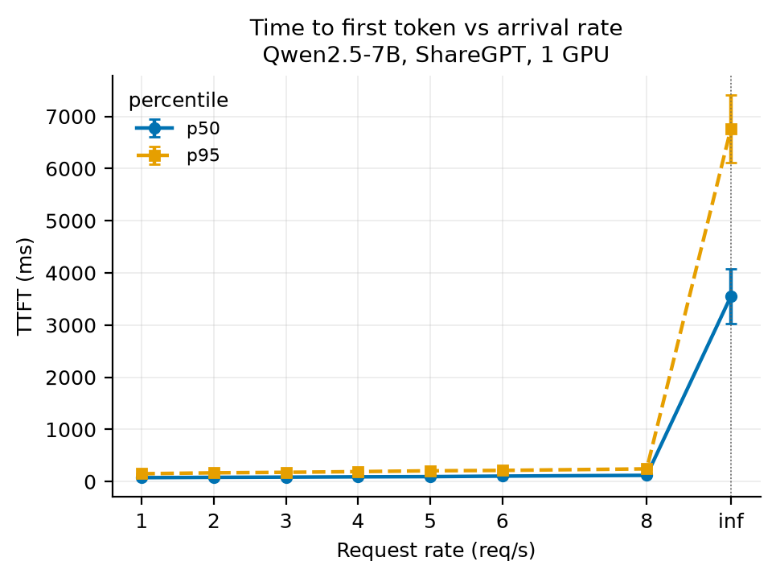

**Figure 3.** Time to first token against arrival rate (Qwen2.5-7B, ShareGPT, one
GPU). Error bars are the standard deviation over the three repetitions of each
point; because repetitions use seeds 1/2/3, they carry prompt-sampling and
arrival jitter as well as system noise. The y-axis is logarithmic. The offline
point (rate = ∞) sits to the right of the dotted rule and is not a continuation
of the finite-rate series: it is a burst transient in which all 200 requests are
submitted at once, two orders of magnitude above the finite-rate values (§4.1).

**Latency.** TTFT increases monotonically with the arrival rate, but the rate of increase is gradual. The p50 increases from 76 ms to 120 ms, and the p95 from 151 ms to 245 ms — an increase of only about 1.6 times as the rate is multiplied by 8 (Figure 3). The same pattern is observed on the decoding side, where TPOT p50 ranges from 33.0 ms to 44.2 ms, and p95 from 34.8 ms to 57.8 ms (Figure 4). On the other hand, only the p95 of inter-token latency (ITL) increases 2.8-fold, from 34.3 ms to 95.0 ms, in contrast to the p50, which remains virtually unchanged at 32.4 ms to 35.6 ms. Median tokens arrive stably even under high load, while only a small number of tokens experience significant delays.

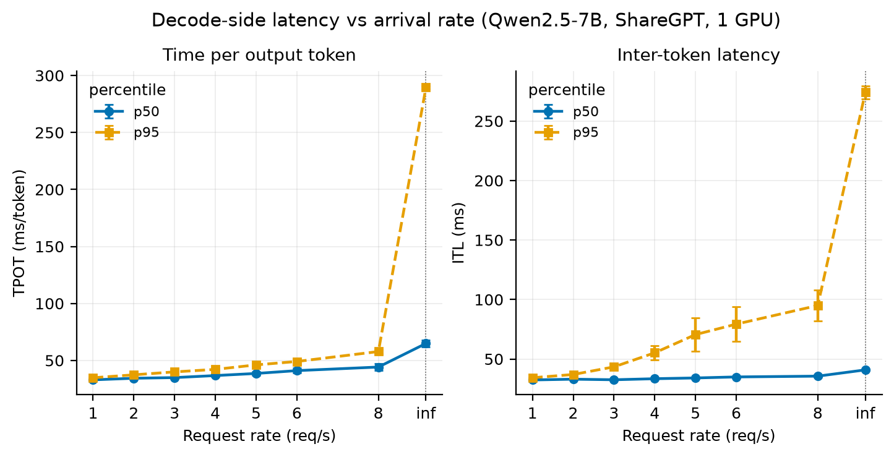

**Figure 4.** Decode-side latency against arrival rate (same runs as Figure 3),
on a logarithmic y-axis. Left: time per output token, which is the mean over a
request's whole generation. Right: inter-token latency, which resolves the
individual gaps between tokens. The p50 of the two panels tracks closely while
the p95 diverges, so the tail is a property of individual token gaps rather than
of whole requests.

**Queuing.** The scheduler-side dwell recorded by the instrumentation averaged between 0.018 and 0.021 ms at every finite rate, with a maximum of 0.08 ms —
three to four orders of magnitude below TTFT. This is dwell in the scheduler's waiting queue only (§3.1): a request waiting anywhere earlier, in the HTTP
frontend or on the path to the engine, is not counted here, and §4.2 shows that 38 % of the client's observed TTFT does fall outside what the server records. What the measurement does establish is that once a request reaches the scheduler it is admitted into the running batch at the next step rather than held, so backlog on the scheduler side registers as batch growth rather than as queue length. The average number of requests included in steps that perform only decoding increases from 6.0 at rate 1 to 18.8 at rate 4 and 23.0 at rate 8, with the maximum expanding from 14 to 76. The scheduler's own waiting count corroborates this: n_waiting, read after each scheduling decision, was 0 at every step of every finite-rate run — mean and maximum alike — so no request was ever deferred for want of capacity, which is consistent with the 2.13 % KV utilization reported in §5.1. That counter is the post-scheduling residual rather than a queue of pending arrivals, so it bounds what the scheduler held back, not what was waiting to reach it.

**Throughput.** Achieved throughput does not reach a clear plateau within the finite grid: by the client's definition it still rises 5.0 % from rate 6 to rate 8, ending at 3.54 req/s (Figure 5, left). This value also depends on the definition used. The client-reported "completed / measured duration" includes the time until the last request completes in its denominator, so even at rate 1 it falls below 1 at 0.95 req/s. Excluding the drain, "completed / arrival window" reaches 5.2 req/s at rate 8. Neither metric is unbiased (§3.4), so the saturation point cannot be determined from this curve alone. Output token throughput increases from 181 to 675 tok/s, with the per-step gain falling to 5 % above rate 5 (Figure 5, right). The ceiling is better read from the closed-loop measurement, where output throughput reaches a practical plateau around 711 tok/s at concurrency 64; concurrency 128 adds only 0.9 %, which §4.5 shows is not distinguishable from zero. At the mean output length of this workload (191.6 tokens per request) that ceiling corresponds to roughly 3.7 req/s, which is consistent with the open-loop series still climbing at rate 8.

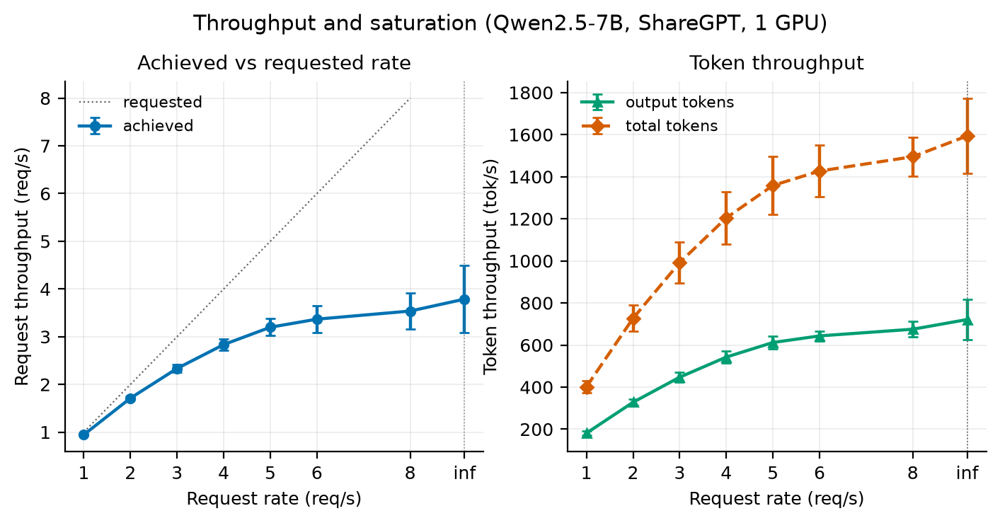

**Figure 5.** Throughput against arrival rate (same runs as Figure 3), on linear
axes. Left: both definitions of achieved request throughput given in §3.4 —
completions over the measured duration, which the drain biases low, and
completions over the arrival window, which excludes requests still in flight and
biases high — against the dotted line where achieved equals requested. Neither
curve is unbiased, and the gap between them is the reason saturation is argued
from latency and from the closed loop instead. Right: output and total token
throughput, the latter counting prompt tokens as well.

**The offline point.** The point where rate = ∞ is not an extension of the finite-rate series. Under this condition, 200 requests are submitted simultaneously, resulting in a TTFT p50 of 3,553 ms and a p95 of 6,767 ms — values that differ by two orders of magnitude from those at finite rates. The average queue time also reaches 2,704 ms. This is not a failure due to saturation, but rather a transient phenomenon caused by the initial burst exceeding the batch capacity; it is not a steady-state measurement. Since the two cannot be interpreted as a single curve, they are separated by a dotted vertical line in the figure.

### 4.2 Phase-level behaviour

<!-- BUDGET 0.6p. Answers RQ1 (phase part) and feeds RQ4. -->

**Phase composition.** Decoding accounts for the overwhelming majority of wall-clock time per request. For ShareGPT at rate 5, out of an end-to-end average of 7,434 ms, prefill accounts for 68.8 ms (0.93 %) and decoding accounts for 7,334 ms (98.7 %). This ratio remains consistent even when the workload is changed: it is 1.94 % for I1 (input 512 / output 128), which is prefill-heavy, and 0.30 % for I2 (input 128 / output 512), which is decoding-heavy; in both cases, prefill remains below 2 % (Figure 6, left). The same holds at every finite rate and in every group; the ratio exceeds 2 % only under the
offline burst, where it reaches 2.7 % at tp = 4. Even when the arrival rate is increased from 1 to 8, the prefill ratio only varies from 0.86 % to 0.96 %.

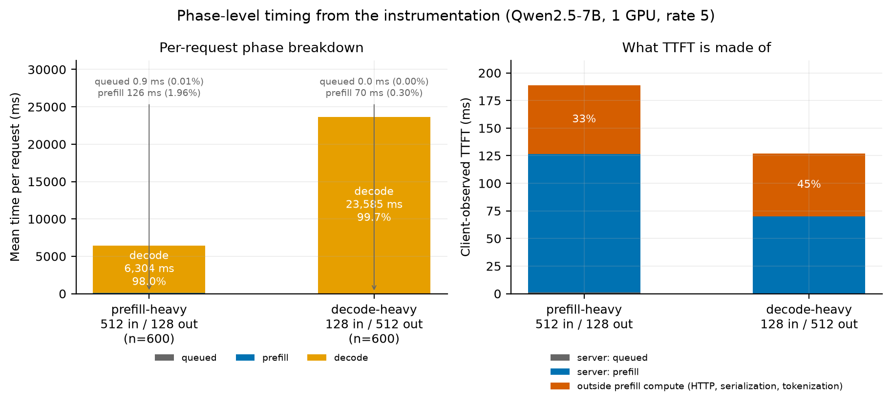

**Figure 6.** Where a request's time goes, and what the client's wait is made of (Qwen2.5-7B, one GPU, rate 5). Left: mean time per request split into queue, prefill and decode for the two fixed-length workloads, from the request-axis log. Queue and prefill are labelled rather than drawn to scale, since at 0.9 ms and 126 ms against a 6.3 s decode they would be invisible; the bars are dominated by decode in both cases even though the two workloads invert the input-to-output ratio. Right: the client-observed TTFT for the same runs, split into the queue and prefill the server recorded and the remainder, which this instrumentation leaves unattributed — it spans HTTP, serialization, tokenization and the path to the engine. Note that the two panels use different vertical scales: the left is in seconds of whole-request time, the right in milliseconds of first-token latency.

**Breakdown of TTFT.** The TTFT observed by the client cannot be explained by what the server records. For ShareGPT at rate 5, the client-observed average
TTFT is 111.6 ms, while the scheduler dwell and prefill interval recorded by the instrumentation total 69.0 ms, so 38 % of what the client waits for is left unattributed by this instrumentation (Figure 6, right). That remainder spans everything the two server-side timestamps do not bracket: HTTP receipt and
response, serialization, tokenization, the frontend-to-engine IPC path, and any dwell in the engine's input queue ahead of Scheduler.add_request() (§3.1).
Which of these dominates was not measured, and separating them would require a timestamp at each hand-off. The same difference is 33 % for I1 and 45 % for I2.

This proportion of time outside the server-recorded interval increases as the model becomes lighter. For the 0.5B model, it increases monotonically: 48 % at rate 1, 59 % at rate 8, and 71 % at rate 32. This is because while the prefill interval itself remains nearly unchanged — from 17.2 ms to 14.4 ms —the client-observed TTFT increases from 33.1 ms to 49.2 ms. For smaller models, the potential for TTFT improvement lies outside the computation itself.

**Impact of the input-to-output ratio.** When only the input-to-output ratio is varied on the same server, the ranking of the two workloads reverses depending on which throughput definition is used. In terms of total token throughput, I1 achieves 2,891 tok/s and I2 achieves 2,144 tok/s, with I1 being 35 % higher. However, in terms of output token throughput, I1 is 578 tok/s and I2 is 1,715 tok/s, making I2 3.0 times higher. This is because the former counts prompt tokens as part of the workload, while the latter does not. Reporting only one of these metrics leads to opposite conclusions from the same measurement.

The efficiency of the prefill itself also depends on the input length. The effective throughput during the prefill interval is 4,070 prompt tokens per second for I1 and 1,829 prompt tokens per second for I2, meaning longer prompts are 2.2 times more efficient. ShareGPT falls between these at 3,385 prompt tokens per second.

**Queue.** Queue dwell time is negligible under all conditions (0.95 ms for I1 and 0.02 ms for I2). The slightly longer dwell time in I1 accompanies its heavier per-request prefill (126 ms against 70 ms, Figure 6).

### 4.3 Effect of dataset and model size

<!-- BUDGET 0.5p. Answers RQ2. Figures 7 and 8 may go to the appendix if space is tight;
     if so, keep the numbers in the text and reference the appendix figures. -->

**The effect of prompt length distribution.** When compared at the same rate, the random workload has a lower TTFT. The p95 values are 109 ms vs. 151 ms (28 % lower) at rate 1, and 211 ms vs. 245 ms (14 % lower) at rate 8 (Figure 7, left). While prompts in the random workload are fixed at 256 tokens, ShareGPT has a tail where the p95 reaches 767 tokens (§3.2). Since the prefill workload is proportional to prompt length, this tail is the likely source of the higher p95 TTFT, though the dataset comparison does not isolate it from output-length effects on system load (see below). The gap narrows as the load increases: from 28 % at rate 1 to 14 % at rate 8.

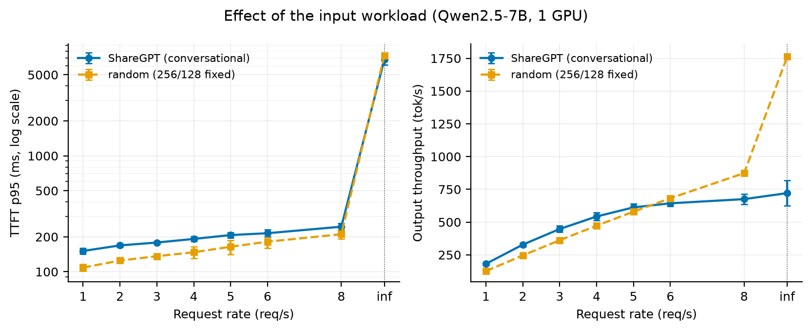

**Figure 7.** ShareGPT against the random workload at matched arrival rates (Qwen2.5-7B, one GPU). Left: TTFT p95 on a logarithmic axis, where ShareGPT sits above random at every finite rate, consistent with its prompt-length tail reaching 767 tokens against a fixed 256. Right: output token throughput on a linear axis, where the ordering reverses above rate 5 — ShareGPT generates 191.6 output tokens per request on average against a fixed 128, so the two workloads do not present the same amount of work at the same arrival rate. The random series shown here is S2. The extension to 20 req/s (S2b) uses a rate grid the ShareGPT series does not cover, so it is reported in the text rather than plotted.

The rankings reverse for output token throughput. ShareGPT outperforms random up to rate 5 (612 vs. 580 tok/s), but random overtakes ShareGPT at rate 8 (675 vs. 874 tok/s). ShareGPT's average output length is 191.6 tokens, while random has a fixed output length of 128 tokens; thus, even at the same arrival rate, the amount of tokens to be generated differs. Consequently, comparing throughput across datasets cannot be done simply by standardizing the rate.

**Difference in delivered throughput.** Since random did not reach saturation on the initial grid (maximum 8 req/s), the grid was extended to 20 req/s in S2b. The achieved throughput continues to increase even at rate 20, reaching 12.10 req/s with an output of 1,549 tok/s, and shows a 12 % increase in the range from rate 16 to 20. The strain appears in latency rather than throughput: TPOT p95 jumps from 50.5 ms at rate 8 to 85.1 ms at rate 12, then plateaus at 97–100 ms. These rates lie beyond the grid shown in Figure 7, which covers the two workloads only where they overlap. No closed-loop sweep was run for random, so its capacity is not established on the same footing as ShareGPT's (§4.5); what the open-loop series supports is that service throughput reached 12.10 req/s at an offered rate of 20, against 3.54 req/s for ShareGPT at rate 8 — more than a threefold difference in what the server delivered under the rates tested, with the steady-state ceiling for random left unmeasured. The two workloads differ in both of its dimensions — ShareGPT's prompts reach a p95 of 767 tokens against a fixed 256, and its outputs average 191.6 tokens against a fixed 128 — so this bounds the combined effect of prompt and output length rather than isolating either. Separating them would require holding output length fixed while varying only the prompt distribution, which this matrix does not do.

**The impact of model size varies by phase.** At rate 1, TTFT p95 is 52 ms for the 0.5B model compared to 151 ms for the 7B model — a 2.9-fold difference — while TPOT p95 is 6.1 ms versus 34.8 ms — a 5.8-fold difference (Figure 8). Since the ratio of parameter counts is 14:1, neither ratio matches it, but the degree of divergence varies significantly between phases. As shown in §4.2, for the 0.5B model, 48–71 % of client TTFT lies outside what the server records, whereas decode carries no comparable fixed component. §5.5 relates this to the phase-dependent ratios above.

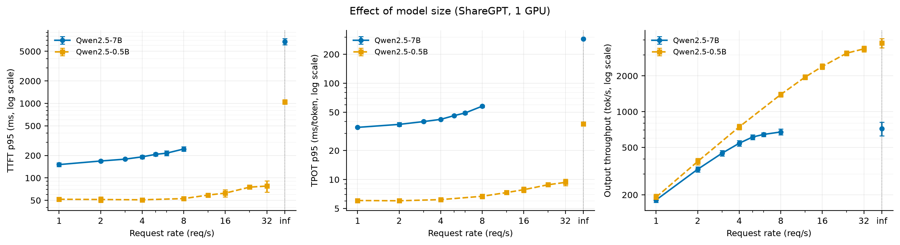

**Figure 8.** Qwen2.5-7B against Qwen2.5-0.5B on ShareGPT (one GPU), with TTFT p95, TPOT p95 and output throughput on logarithmic axes. The two models are swept over different arrival-rate grids ({1…8} and {1…32} req/s, §3.3) because the 0.5B model does not saturate within the 7B grid, so the series overlap only up to rate 8; beyond that point the 0.5B curve stands alone and is not a comparison. The vertical separation differs by phase — roughly threefold on TTFT against roughly sixfold on TPOT at rate 1 — which §4.2 attributes to the larger non-model component outside the server-recorded interval

**The response to load also differs.** The p95 TTFT for 0.5B remains nearly flat at 51–53 ms from rates 1 to 8, in contrast to 7B, which rises from 151 ms to 245 ms. 0.5B begins to respond to load at rate 12 and beyond, increasing from 59 ms to 78 ms (rate 32). Since the two models were measured at different arrival rate grids (§3.3), the results up to rate 8 should be interpreted as a comparison under the same load, while those beyond that point should be interpreted as the behavior of the 0.5B model alone. The peak output throughput is 675 tok/s for the 7B at rate 8 and 3,371 tok/s for the 0.5B at rate 32, a difference of 5.0 times.

### 4.4 Effect of GPU count and parallelism strategy

<!-- BUDGET 0.6p. Answers RQ3. -->

**Tensor parallelism.** Increasing the number of GPUs to two improves achieved throughput by 32.5 % at rate 8 and 44.0 % at rate ∞ (Figure 9). With four GPUs, the improvements are 52.0 % at rate 8 and 55.4 % at rate ∞; however, the incremental gains from two to four GPUs are limited to 14.7 % and 7.9 %, respectively, indicating a clear diminishing return. Per GPU, achieved throughput at rate 8 falls from 3.51 req/s at tp = 1 to 2.33 req/s at tp = 2 (66 %) and 1.34 req/s at tp = 4 (38 %). G1, G2, and G4 were measured on the same instance (§3.3), and in a comparison with matched seeds, the gains for tp = 2 at rate 8 were +38.7 %, +26.1 %, and +34.2 % — all three seeds clearly positive. Note that these values were measured with NCCL peer-to-peer transfers and the custom all-reduce kernel disabled (§3.3) and represent the lower bound of achievable gains.

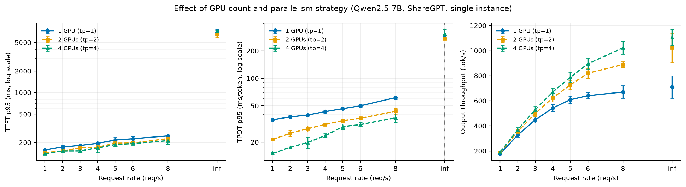

**Figure 9.** TTFT p95, TPOT p95 and output throughput against arrival rate for one, two and four GPUs (7B, ShareGPT). All three series were measured on one 4×A40 instance, so host differences cannot contribute. Every tensor-parallel figure in this section was obtained with NCCL peer-to-peer transport and the custom all-reduce kernel disabled (§3.3); these are therefore conservative lower bounds on the achievable gain.

The gains vary depending on the phase. At rate 8, the decode-side TPOT p95 decreases from 61.4 ms at tp = 1 to 43.6 ms at tp = 2 and 36.9 ms at tp = 4. On the other hand, the prefill-side TTFT p95 changes only from 248 ms to 227 ms and then to 213 ms. In terms of phase time per request, at rate 5, tp = 2 reduces prefill time by 13.2 % and decode time by 28.5 %, while at tp = 4, the reductions are 16.9 % and 42.5 %, respectively (Figure 10). Tensor parallelism is primarily effective for decoding.

**Pipeline parallelism.** When the number of GPUs is fixed at two and only the strategy is changed, throughput and latency decouple. The achieved throughput for pp = 2 is indistinguishable from that of tp = 1. The average difference across 23 seed-matched pairs (8 rates × 3 repetitions, less the pair containing the failed run, §3.3) is −0.3 %, with t = −0.43, which is not significantly different from zero. Although individual points fluctuate by up to ±9.2 %, the sign is inconsistent, in contrast to tp = 2, which is positive at all 23 points in the same test. Using the same two GPUs, tp = 2 achieves a 32.5 % gain at rate 8, whereas pp = 2 converts none of the second GPU into throughput.

The results are reversed for latency. The TTFT p95 for pp = 2 falls below that of tp = 1 at all 20 points on the finite grid with matched seeds, with an
average of −12.0 % (t = −12.1). The per-rate tests are weaker than the pooled one, and for the same reason as in the C1 control (§3.5): three seed pairs give two degrees of freedom, where the two-sided 5 % critical value is |t| = 4.303. Across the seven finite rates |t| runs from 2.77 (p = 0.11) to 14.29, and four of the seven clear that threshold. The finding therefore rests on the pooled comparison and on the sign being negative at all 20 points, not on each rate being separately significant. The same magnitude is observed in the mean TTFT at −11.9 % (t = −13.6), so this is not a phenomenon specific to p95. The average prefill time recorded by the instrumentation is also reduced by 10.4 % at rate 5. That accounts for under half of the client-side reduction. Against the G1 baseline at rate 5, mean TTFT falls from 115.1 ms to 99.2 ms; prefill accounts for 7.4 ms of that 15.9 ms, and the unattributed residual outside the server's timestamps (§4.2) for the remaining 8.5 ms, falling from 44.1 ms to 35.6 ms. That interval shrinks by 19 %, plausibly because the engine runs two worker processes rather than one, changing contention on the frontend path — but that is a host- and configuration-level effect this instrumentation does not resolve, and it is larger than the ±3 % tolerance §3.5 establishes for this comparison. On the other hand, decoding remains unchanged. The change in average decode time at the same rate is −1.7 %, which falls within the estimated tolerance for host-to-host variation between sessions (§3.5) and aligns with the direction in which that bias already acts.

It is noteworthy that, in terms of prefill improvements, pp = 2 is not inferior to tp = 2. In the same seed-matched test, the TTFT p95 for tp = 2 is −10.0 % (t = −9.8), which is nearly equivalent to the −12.0 % for pp = 2. When using two GPUs, prefill latency improves by roughly the same amount with either strategy, but only tensor parallelism increases throughput.

The contrast is therefore one-sided: prefill latency responds to either strategy, throughput only to tensor parallelism. §5.3 accounts for the mechanism.

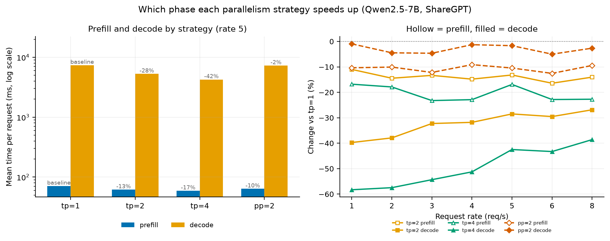

**Figure 10.** Which phase each parallelism strategy shortens (Qwen2.5-7B, ShareGPT). Left: mean prefill and decode time per request at rate 5 on a
logarithmic axis, annotated with the change against tp = 1; the two phases differ by two orders of magnitude, hence the log scale. Right: the same change against tp = 1 across the rate grid, hollow markers for prefill and filled for decode. The tp series is read against a shared baseline within one instance, whereas pp = 2 was measured in Session D on a separate host and carries the ±3 % tolerance established in §3.5; the prefill reduction under pp = 2 clears that tolerance while the decode change does not. Because pipeline parallelism forces vLLM onto the batch-queue execution path, Session D produces no step-axis log (§3.1), so the phase times here are request-axis quantities and the step-level decomposition in §5.2 is available for the tp series only.

### 4.5 Closed-loop behaviour

<!-- BUDGET 0.4p. Completes RQ1: the steady-state view that open-loop
     overload points cannot provide. -->

In open-loop measurements, there is no steady state for arrival rates exceeding capacity (§4.1). In closed-loop measurements, where the number of in-flight requests (the concurrency limit) is fixed, each point has a steady state, allowing the trade-off between latency and throughput to be directly observed.

**Trade-off.** As the concurrency limit increases from 1 to 128, the output throughput increases 22-fold, from 31.9 tok/s to 717.4 tok/s. Meanwhile, the p95 value for end-to-end latency remains nearly flat at 19.2–20.6 seconds up to 8 concurrent executions, then rises from 23.0 seconds to 27.8 seconds starting at 16 (Figure 11).

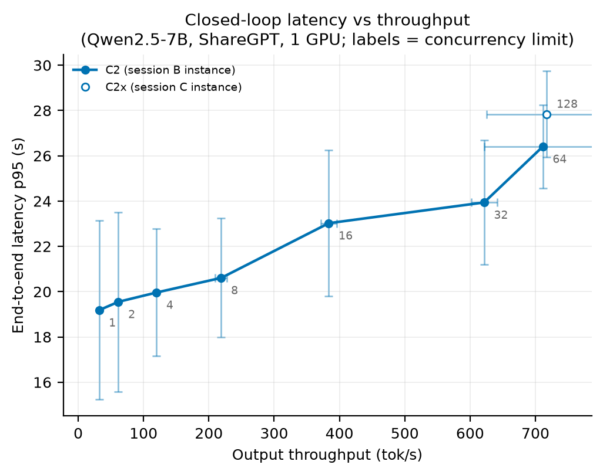

**Figure 11.** Closed-loop latency-throughput trade-off (7B, ShareGPT, 1 GPU).
Each point is one concurrency limit, labelled on the plot; error bars are the
standard deviation over three repetitions on both axes. C2x (c=128, open marker)
was measured on the Session C instance.

By examining the marginal gains for each interval, we can identify the point at which the trade-off becomes unfavorable. At each stage where the number of concurrent executions doubles from 1 to 32, throughput increases by 62–95 %, whereas the increase in the p95 value is limited to 2–12 %. From 32 to 64, throughput increases by 14.5 % while p95 increases by 10.3 %, with the two remaining roughly in balance. From 64 to 128, throughput increases by only 0.9 %, while p95 increases by 5.4 %. Therefore, the inflection point lies between 32 and 64 concurrent executions; beyond that, additional parallelism consumes only latency.

**Comparison with the open loop.** The closed loop delivers 711.3 tok/s at 64 concurrent executions, or 3.73 req/s in terms of requests; concurrency 128 measures 717.4 tok/s, but that 0.9 % increment crosses instances and lies within the 0.97 % anchor spread (§3.5), so the two are not distinguishable and 64 is where the trade-off turns. For the open loop at rate 8, the values are 675.2 tok/s and 3.54 req/s, with the closed loop outperforming it by 5.4 %. As noted in §4.1, the open-loop series is still on an upward trajectory at rate 8, so this difference indicates that the two are approaching the same upper limit via different paths. The values from the closed loop, which has a steady state, are more direct as estimates of capacity.

**Structure of variance.** The variances along the two axes are inversely correlated. At a concurrency level of 1, the coefficient of variation for output throughput is 0.4 %, whereas that for p95 latency is 20.6 %. At a concurrency level of 128, these figures reverse to 12.9 % and 6.8 %, respectively. This asymmetry also stems from the measurement conditions. The runs used 60 requests at concurrency 1 and 2, 120 at 4 and 8, and 200 at 16 and above (§3.3), so the lower the concurrency, the fewer samples determine the p95. This is why error bars are plotted on both axes in Figure 11; showing only one axis would obscure either the uncertainty at low concurrency or that at high concurrency.

## 5. Bottleneck Analysis

<!-- BUDGET 1.2p. REASONS. This section carries the originality of the report.
     Write it in this order - the order is the argument. -->

### 5.1 The KV cache is not the constraint

As shown in §4.4, tensor parallelism improves throughput by up to 52 %. The first hypothesis to consider in explaining this gain is the KV cache capacity. Adding more GPUs increases the total size of the KV space, allowing it to hold more requests simultaneously. As batch sizes increase, the amount of data processed per step increases, leading to higher throughput — this path is plausible, and KV-space management is central to vLLM's design.

The measurement rejects this hypothesis. In the single-GPU configuration at rate 8, the KV cache utilization averaged 2.13 % per step and peaked at 6.43 %. Over 97 % of the capacity remained unused. A resource with ample capacity cannot be a constraint.

Furthermore, increasing tp does not raise utilization; on the contrary, it decreases. It is 0.77 % at tp = 2 and 0.33 % at tp = 4. This is because while the total size of the KV space increases proportionally with the number of GPUs, the number of requests held simultaneously remains constant. If KV capacity were a constraint, utilization would plateau at a high level when tp is increased, and the relief from that constraint would manifest as improved throughput; however, the observed order is the reverse.

The number of requests included in the decoding step also remains nearly constant across tp values. At rate 8, the average was 22.9 for tp = 1, 22.3 for tp = 2, and 21.7 for tp = 4. Parallelization has not increased the batch size. Therefore, the improvement in throughput is not due to an increase in batch size.

### 5.2 The mechanism: shorter steps at constant batch

In §5.1, we showed that tensor parallelism does not increase the batch size. The throughput gain must therefore originate elsewhere. The step-axis log shows that the execution time per step itself has decreased.

The reduction in execution time varies by phase. At rate 8, the model execution time for steps that perform only decoding is reduced from 32.27 ms at tp = 1 to 22.27 ms at tp = 2 and 17.95 ms at tp = 4 (1.45x, 1.80x). On the other hand, steps that carry prefill only decrease from 72.34 ms to 63.27 ms and then to 57.33 ms (1.14x, 1.26x). The same parallelization settings produce different effects depending on the phase (Figure 12, left).

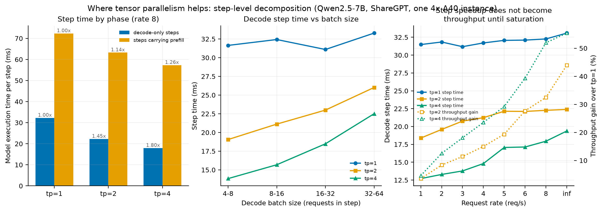

**Figure 12.** Why tensor parallelism helps, measured at step granularity (Qwen2.5-7B, ShareGPT, one 4×A40 instance). Left: mean model-execution time per
engine step at rate 8, split by whether the step carried context tokens; annotations are the speedup against tp = 1. Chunked prefill is on by default, so
"carrying prefill" means the step also processed context tokens, not that it was a contiguous prefill interval. Centre: the same decode-only steps binned by
requests per step — the tp = 1 line is flat while the sharded lines rise. Right: decode step time and throughput gain against arrival rate on separate axes; step time is nearly flat while the gain climbs. Step times are averaged over the measured section of each run (§3.4). Pipeline parallelism produces no step-axis log (§3.1), so pp = 2 does not appear.

Combined with the fact that the batch size is constant (§5.1), the mechanism is clear. Parallelization does not process more requests simultaneously; rather, it processes the same number of requests faster.

The extent of the reduction depends on the batch size. When decoding steps are stratified by batch size, the speedup for tp = 4 decreases monotonically: 2.29-fold for batches 4–8, 2.07-fold for 8–16, 1.68-fold for 16–32, and 1.48-fold for 32–64 (Figure 12, center). The step time for tp = 1 remains nearly constant regardless of the batch size (31.1–33.3 ms, 7 % variation), whereas tp = 2 increases with batch size from 19.06 ms to 26.02 ms, and tp = 4 increases from 13.83 ms to 22.51 ms. The gain achieved through partitioning is greater for smaller batches.

Reducing the step time only begins to translate into throughput once saturation is reached. At rate 1, the decoding step for tp = 4 is 2.48 times faster than that for tp = 1 (12.71 ms vs. 31.48 ms). However, the improvement in achieved throughput is limited to 4.6 %. In regions where the arrival rate is below capacity, the arrival rate determines throughput, and faster steps merely increase idle time. The gap narrows as the load increases: at rate 8, a 1.80-fold increase in step speed results in a 52.0 % increase in throughput, while at rate ∞, a 1.71-fold increase yields a 55.4 % increase (Figure 12, right). Measured at rate 1 the same configuration reports a 4.6 % gain; at rate 8 it reports 52.0 %. A single throughput number is meaningful only together with the rate at which it was taken.

### 5.3 Why decode benefits more

<!-- Per-GPU weight traffic falls with tensor parallelism, relieving a
     memory-bandwidth-bound phase; prefill is compute-bound and gains less.
     Connect back to 4.2. -->

The two observations presented in §5.2 — that decoding time is reduced by a factor of 1.80 while prefill time is reduced by only a factor of 1.26, and that the decoding gain decreases as the batch size increases — are two manifestations of the same principle.

**Decoding is memory-bandwidth-limited.** This is an established characterization rather than a finding of this work. The roofline model [@Williams2009] classifies a kernel as memory- or compute-bound by its arithmetic intensity, and Yuan et al. [@Yuan2024] apply it layer by layer to LLM inference: for a 7B model at batch 1, the projection layers are compute-bound during prefill while every layer is memory-bound during decode. What the resource log adds is an observation of that regime inside a running server, and of how tensor parallelism displaces it. At rate 8 on the four-GPU instance, SM utilization remains virtually unchanged, ranging from 87.9 % at tp = 1 (group G1) to 82.1 % at tp = 4. In contrast, memory controller utilization drops from 93.6 % to 64.3 % and then to 39.5 %, falling by more than half. The counter reports the fraction of the sampling interval during which device memory was being read or written, not the achieved fraction of the 696 GB/s peak, so 93.6 % establishes that memory was in near-continuous use rather than that bandwidth was exhausted. What the divergence between the two counters shows is that sharding relieves the memory side while leaving the compute side where it was; the same amount of arithmetic is still being performed. GPU power consumption also decreased by 34 %, from 285 W to 187 W, consistent with a reduction in memory traffic per device, though the counter does not attribute consumption to any one activity.

The magnitudes agree with this account. Following the roofline formulation, the A40's memory bandwidth is 696 GB/s and the Qwen2.5-7B's bf16 weights total approximately 15.2 GB. Since the decoding step reads all parameters once, weight transfer alone takes 21.8 ms. This accounts for 68 % of the measured step time of 32.27 ms at tp = 1. At tp = 4, the weight size per GPU is 3.8 GB, reducing the transfer time to 5.5 ms; however, the measured time is 17.95 ms, with weight transfer accounting for only 30 % of this. As partitioning increases, non-weight costs — such as all-reduce communication and kernel launches — become relatively larger.

**Prefill has already amortized the weight cost.** The prefill step processes hundreds to over a thousand tokens simultaneously. Weights are read once per step, and that cost is divided by the number of tokens processed. Prefill is therefore compute-dense, and is limited by arithmetic throughput rather than memory bandwidth. Reducing weight transfer per GPU through partitioning merely alleviates the burden on non-bottlenecked resources, so the effect is limited. The observed value of 1.26 times reflects this. The same asymmetry appears when memory traffic is reduced by other means: Yuan et al. [@Yuan2024] report that fusing attention kernels cuts inference time by the full amount of the memory access it saves during decode, but by less than that during prefill, because part of the prefill work is already compute-bound. Sharding and kernel fusion are different mechanisms, yet both reduce bytes moved per unit of computation, and both produce the same split between the phases.

**Batch dependency follows the same principle.** As the number of requests included in a decoding step increases, a single weight read is amortized across more tokens. In other words, decoding steps with larger batches exhibit characteristics similar to the prefill step. At tp = 1, even when the batch size is increased eightfold from 4–8 to 32–64, the step time increases by only 5.2 % (from 31.64 ms to 33.29 ms). The marginal cost per additional request is 39 µs, indicating that weight transfer — a fixed cost — is the dominant factor.

This pattern changes after partitioning. At tp = 4, because the fixed cost is reduced to one-fourth, the same batch size increase results in a 62.7 % increase in step time, and the marginal cost reaches 207 µs — 5.3 times that of tp = 1. This is consistent with variable costs — all-reduce communication among them — growing with batch size, though the measurement does not isolate all-reduce from the rest of the residual (§5.4). As fixed costs decrease and variable costs increase, the benefit of partitioning diminishes as the batch size grows. The decline from 2.29x to 1.48x observed in §5.2 is a consequence of this. This crossover is not specific to tensor parallelism. Yuan et al. [@Yuan2024] observe the same effect for quantization: at small batch the layers are memory-bound and reducing weight precision shortens inference time, while at large batch the network has become compute-bound and further compression buys nothing. Quantization and sharding both reduce the weight bytes each GPU moves per step; the measurement here places the onset of strongly diminishing returns between the 16–32 and 32–64 batch ranges.

**Pipeline parallelism does not touch this quantity.** Splitting the model by stages leaves every weight on exactly one GPU, so each device still streams its own share once per step and the aggregate weight traffic per token is unchanged. The measurement matches: pp = 2 changes mean decode time by −1.7 %, within the tolerance for this comparison (§3.5), while tp = 2 on the same two devices cuts it by 28.5 % (§4.4). Prefill behaves differently only because a prefill step carries many tokens, which can be handed from stage 0 to stage 1 while the next group is still being processed; that overlap is consistent with the 10.4 % reduction in mean prefill time observed under pp = 2, though Session D produces no step-axis log (§3.1) and the mechanism was not measured directly. Decode admits no such overlap, since one step produces one token per request and the two stages must run in series.

In summary, tensor parallelism reduces the weight streaming each GPU performs, and is effective only where that streaming is the rate-limiting factor; pipeline parallelism leaves it untouched and gains only where stages can overlap. Decoding satisfies this condition with small batches, while prefill does not. Decoding increasingly departs from this condition as the batch size increases. As shown in §4.2, decoding accounts for 98.7 % of the request time, so this mechanism governs the overall throughput.

### 5.4 Sublinear scaling and topology

<!-- tp=4 crosses NUMA (SYS) whereas tp=2 stays within one NUMA node (PXB).
     Reference the recorded `nvidia-smi topo -m` output in Appendix C. -->

The gain from doubling the degree of parallelism is not constant. At rate 8, the gain from tp = 1 to tp = 2 is 32.5 %, whereas the gain from tp = 2 to tp = 4 is 14.7 %, less than half. At rate ∞ the difference is larger still: 44.0 % against 7.9 %. Step times behave the same way, with the reduction falling from 1.449x (72 % of the ideal 2.0) to 1.241x (62 %).

**What sharding can divide, and what it cannot.** Using the weight-transfer time from §5.3 makes the shape of the diminishing return visible. Subtracting the theoretical weight-transfer time from the step time leaves a residual of 10.43 ms at tp = 1, 11.35 ms at tp = 2, and 12.49 ms at tp = 4. Weight transfer falls exactly in inverse proportion to the shard count, from 21.84 ms to 5.46 ms, but the residual does not fall at all: it grows by 19.7 %.

This decomposition is an approximation, and it carries two reservations. First, the weight-transfer time is computed from the A40's theoretical peak bandwidth of 696 GB/s; effective bandwidth is lower, so both the absolute residual and its growth rate depend on that assumption. Assuming an effective bandwidth 10 % below peak puts the growth just under 50 %. Second, the residual is not a measurement of communication. At tp = 1 the residual is already 10.43 ms, and that configuration has no inter-GPU traffic, so the residual also collects attention computation, kernel launches, and framework overhead. The 2.06 ms increment from tp = 1 to tp = 4 is consistent with the added all-reduce, but it has not been isolated from the rest.

What the decomposition does show is a single point: the part that sharding can shrink becomes smaller, while the part it cannot shrink does not. As the degree of parallelism rises, the latter takes up a larger share, and the gain diminishes.

**The topology is not symmetric.** According to the recorded `nvidia-smi topo -m` output (Appendix C), GPU0 and GPU1 are connected by PXB and both belong to NUMA node 0. GPU2 and GPU3 are connected by PIX and belong to NUMA node 1. Between GPU0 and GPU2 the path is SYS, that is, across the CPU interconnect. The CPU affinities are likewise split, 0-23,48-71 against 24-47,72-95.

The resource log confirms which GPUs were used. At tp = 2, GPU0 and GPU1 each hold 43,831 MiB of VRAM while GPU2 and GPU3 hold 3 MiB, so the all-reduce at tp = 2 completes within one NUMA node over the PXB link. At tp = 4 all four devices hold 44,115 MiB, so part of every aggregation necessarily crosses SYS. This difference in path is a plausible contributor to the growth in the residual.

Memory-controller utilization is symmetric within each configuration (39.5 / 39.3 / 39.7 / 39.4 % at tp = 4), so the bandwidth relief reported in §5.3 is not an artifact of one device.

**These measurements are a conservative lower bound.** As stated in §3.3, NCCL peer-to-peer transport and the custom all-reduce kernel are disabled in this environment (D43). The server log records that PYNCCL was in fact selected as the all-reduce backend, so optimized paths such as `QUICK_REDUCE` and `SYMM_MEM` were not used. These mechanisms lower communication cost, so disabling them pushes the residual up. The diminishing return observed here may therefore be stronger than what the same GPU configuration could achieve.

### 5.5 CPU and framework-bound behaviour

<!-- The 0.5B model reaches a framework-bound regime (D27). Per-process CPU from the
     resource logger. This is where the task's "Document CPU performance" is answered. -->

The analysis so far has concerned the 7B model. With the 0.5B model, the limiting resource changes.

**Throughput plateaus while the GPU sits idle.** At rate 8, the 7B model reaches 88.8 % SM utilization and 94.2 % memory-controller utilization on the single-GPU instance (group S1), the same near-continuous memory traffic described in §5.3 for G1. The two groups differ by under one percentage point on each counter and by 12 W on power, which is consistent with the between-session drift the A1 anchor bounds for throughput (§3.5). At the same rate the 0.5B model reaches only 54.9 % and 39.3 %. Raising the rate to 32 leaves these at 53.3 % and 38.8 %, so nearly half the GPU remains unused (Figure 13, left). GPU power tells the same story: 173–182 W for the 0.5B model against 273 W for the 7B, a difference of 100 W that reflects computation not being performed.

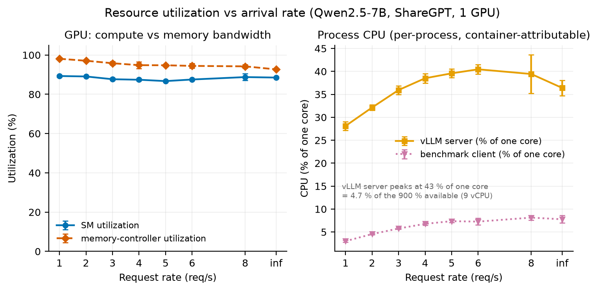

**Figure 13.** Resource utilization against arrival rate for the two model sizes (ShareGPT, one GPU). Left: GPU counters from nvidia-smi — GPU utilization is the fraction of time any kernel was resident, memory-controller utilization the fraction of time the scontroller was busy. The 7B curves sit near saturation on the memory controller while the 0.5B curves leave both counters below 60 %. Right: CPU from psutil, summed over the processes classified as server and as client, in percent of a single core, so values above 100 % mean the group spans more than one core. The two panels cross: moving from 7B to 0.5B lowers the GPU counters and raises the CPU curve. The models are swept over different rate grids ({1…8} and {1…32} req/s, §3.3), so they overlap only up to rate 8. Samples are taken at 1 Hz and averaged over the measured section of each run, excluding start-up and warm-up (§3.4).

**The CPU side behaves in the opposite way.** The CPU usage of the vLLM server-side processes rises only from 28.1 % at rate 1 to 39.4 % at rate 8 for the 7B model, peaking at 40.5 % at rate 6. For the 0.5B model it starts at 65.3 % at rate 1, climbs to 120.8 % at rate 8, and peaks at 144.4 % at rate 24 (141.2 % at rate 32). The counter sums the processes the logger classifies as server, which in vLLM V1 is at least the frontend and the engine core (§3.1), so values above 100 % mean the group exceeds one core-equivalent and say nothing about how any one process is threaded. The benchmark client follows the same trend, rising from 3.9 % to 40.6 %.

**This is not exhaustion of CPU resources.** System-wide CPU usage stays between 5 % and 8 % throughout, for both models. The server-side group occupying 1.4 core-equivalents leaves ample headroom, so the limit is not the quantity of CPU available. What the measurement supports is that host-side work in the serving layer — scheduling, tokenization, HTTP handling and their hand-offs — grows into the space a short model step leaves. It does not identify which of them is the constraint, nor whether any of them is serial: the counter is an aggregate over processes and was not resolved by process or thread. A CPU profile would separate them. The regime is framework-bound rather than CPU-bound.

**The step-axis log corroborates this.** The share of per-step time spent in scheduling is 2.2 % for the 7B model at rate 8 (0.801 ms against 36.17 ms of execution), against 5.4 % for the 0.5B model (0.303 ms against 5.29 ms). At rate 32 the 0.5B figure rises to 8.2 % (0.549 ms against 6.18 ms). The smaller the model — and therefore the shorter its execution step — the larger the share taken by fixed CPU work, and that share grows with load.

This result matches the observation in §4.2, where 48–71 % of the client-observed TTFT for the 0.5B model fell outside what the server records,
with the proportion rising with the arrival rate. The CPU-side work measured here is a candidate for what occupies that interval, though the 1 Hz per-process samples and the per-request residual are not on a common timeline. For small models, the serving layer appears to determine performance more than the model itself.

## 6. Threats to Validity

<!-- BUDGET 0.4p. A plain list. Honesty here is worth more than polish. -->

<!--
  - tp=2/4 measured with NCCL P2P and custom all-reduce disabled; the reported gains are
    conservative lower bounds
  - no NVLink on the test host; an NVLink system would likely scale differently
  - G1_r1_rep1 returned 199/200 completions and was not re-run, by design
  - the harness truncates ShareGPT prompts at ~1024 tokens
  - rate=inf is not a continuation of the finite-rate series
  - a single GPU model (A40) and a single model family (Qwen2.5)
-->

**Measurement conditions.** Every tensor-parallel measurement was taken with NCCL peer-to-peer transport and the custom all-reduce kernel disabled (§3.3, D43). Both mechanisms lower communication cost, so the reported gains (+32.5 % at rate 8) are conservative lower bounds and the diminishing return observed in §5.4 may be stronger than what this hardware could achieve. The test host has no NVLink; inter-GPU paths are limited to PXB and SYS. On an NVLink system the relative standing of tensor and pipeline parallelism could differ.

**Assumptions in the residual decomposition.** The residual reported in §5.4 (10.43 ms at tp = 1, 12.49 ms at tp = 4) is obtained by subtracting a weight-transfer time computed from the A40's theoretical peak bandwidth of 696 GB/s. Effective bandwidth is lower, so both the absolute residual and its 19.7 % growth depend on that assumption; an effective bandwidth 10 % below peak puts the growth just under 50 %. The residual is also not a measurement of communication — it collects attention computation, kernel launches, and framework overhead as well. The increment is consistent with the added all-reduce but has not been isolated from the rest.

**Cross-session comparison.** The A1 anchor ties Sessions A through C to within 0.97 %, but Session D (P1) carries no anchor. A working tolerance of ±3 % was derived from a single 20-request tp = 1 boot warm-up (§3.5). Differences smaller than that tolerance are not interpreted.

**Asymmetry in scheduler time.** Per-step scheduling time is 0.848 ms at tp = 1 against roughly 0.22 ms at tp = 2 and tp = 4. The difference is presumably an artifact of how worker processes are arranged, but this was not established by measurement. At 0.6 ms against a 32 ms step it could inflate the tp = 2 gain (+32.5 %) by about 2 %. The direction of the conclusion is unaffected, but the gain is overstated by that margin.

**Resource counter definitions.** GPU counters are read from nvidia-smi once per second, and the CPU columns are sums over the processes the logger classifies as server or as client rather than per-process measurements. The server classifier matches any command line containing vllm, so the logger itself is counted on the server side whenever it runs from a path containing the repository name; the offset is on the order of a few percent of one core and does not affect the comparison between model sizes, which spans 28 % to 144 %.

**Statistical power.** The C1 control (instrumentation on versus off) used three seed pairs, so the paired t-test has two degrees of freedom and the smallest p-value is 0.125 (§3.5). What the control supports is an observed mean difference — +2.97 % on latency and −0.26 % on throughput — not a detection of the effect, and with n = 3 it does not establish a tight upper bound either: the 95 % interval on the largest difference spans roughly −1.8 % to +7.7 %.

**Workload constraints.** The harness sampler truncates prompts at 1,024 tokens, so the realised ShareGPT distribution lacks the tail of the nominal one: a nominal maximum of 66,076 tokens against a realised maximum of 1,010 (§3.2). The claim of a realistic conversational workload holds only within that bound. Long-context behaviour was not measured.

**Seed dependence from the output-length tail.** ShareGPT's realised output lengths have a p95/p50 ratio of 5.8. Under offline conditions a run ends when its longest request completes, so achieved throughput varies by 41 % across seeds (§3.2). Capacity is therefore not derived from rate = ∞ but from the shape of the closed-loop curve.

**One failed run.** G1 at rate 1, repetition 1 returned 199 of 200 completions and was recorded as a failure. It was not re-run, so that single point rests on two repetitions rather than three. The other 231 runs all completed.

**The offline point.** Rate = ∞ is not a continuation of the finite-rate series. It is a burst transient in which 200 requests are submitted at once, and the TTFT p50 of 3,553 ms is not a saturation failure (§4.1). The two cannot be read as a single curve.

**Scope of generalization.** The measurements cover one GPU model (A40 48GB), one model family (Qwen2.5 at 7B and 0.5B), and two datasets. Extrapolation to other architectures, precisions, or sequence-length distributions lies outside what was measured.

## 7. Conclusion

<!-- BUDGET 0.3p. One short paragraph per RQ, answering it directly.
     No new numbers that have not appeared above. -->

**RQ1 — arrival rate and capacity.** Multiplying the arrival rate eightfold, from 1 to 8 req/s, raises TTFT p50 only 1.6-fold, from 76 ms to 120 ms. The increase appears in the tail rather than the median: ITL p95 grows 2.8-fold while its p50 barely moves. Mean scheduler queue dwell stayed at or below 0.021 ms at every finite rate of this sweep, and the scheduler's waiting count was 0 at every step of it, because vLLM admits waiting requests into the running batch at the next scheduling step rather than holding them; backlog on that side registers as batch growth rather than queue length. This is a scheduler-side measurement — the client-observed wait also contains a frontend and transport component that §4.2 quantifies. That structure makes achieved throughput a weak indicator of saturation — its value depends on which definition is used, and it does not flatten within the finite grid. Capacity was therefore estimated from the closed-loop measurement instead. Raising the concurrency limit, the trade-off comes into balance between 32 and 64, and from 64 to 128 throughput gains only 0.9 % while latency costs 5.4 %. The ceiling is 711 tok/s, or roughly 3.7 req/s at this workload's mean output length of 191.6 tokens.

**RQ2 — workload and model size.** Changing the request-length distribution — prompt and output together — moves delivered throughput by more than a factor of three: random reached 12.1 req/s at an offered rate of 20, while ShareGPT's closed-loop ceiling is near 3.7 req/s. The two figures are not measured the same way — no closed-loop sweep was run for random — so this is a difference in what the server delivered under the rates tested rather than a comparison of steady-state capacity. The two workloads differ in both dimensions, so this is the combined effect, not the effect of prompt length alone. The comparison depends on the metric, however. Inverting the input-to-output ratio on the same server makes I1 35 % higher in total token throughput and I2 3.0 times higher in output token throughput — opposite conclusions from the same measurement. Phase composition is stable across workloads: prefill accounted for between 0.30 % and 1.94 % of end-to-end time at every finite rate, reaching 2.7 % only in the offline burst, where all 200 requests arrive at once. The effect of model size is phase-dependent. Between 7B and 0.5B, a 14:1 difference in parameter count, TPOT differs by 5.8× while TTFT differs by only 2.9×, because TTFT carries a component outside the server-recorded interval that reaches 48–71 % on the 0.5B model and grows with load.

**RQ3 — GPU count and parallelism strategy.** A second GPU raises achieved throughput by 32.5 % at rate 8, and a fourth by 52.0 %, with the increment falling to 14.7 %. The gain is phase-selective: at rate 5, tp = 2 shortens decode by 28.5 % but prefill by only 13.2 %. Holding the device count at two and changing only the strategy separates the two outcomes completely. The achieved throughput of pp = 2 is indistinguishable from tp = 1 — the mean difference across 23 seed-matched points is −0.3 % (t = −0.43) — while its TTFT p95 falls at all 20 points, averaging −12.0 % (t = −12.1). That is on par with the −10.0 % of tp = 2. The second GPU raises throughput only under tensor parallelism; prefill latency responds to either strategy.

**RQ4 — the limiting resource.** The KV cache is not the constraint: utilization was 2.13 % at rate 8 and falls further as tp increases, and the decode batch size stayed nearly constant across tp. What produces the throughput gain is shorter steps. Decode-only steps run 1.80× faster from tp = 1 to tp = 4 (32.27 ms to 17.95 ms), while steps carrying prefill improve only 1.26×. The asymmetry follows from decode being memory-bandwidth-bound and prefill compute-bound, and the resource log is consistent with it: SM utilization moves only from 88 % to 82 %, while memory-controller utilization falls from 93.6 % to 39.5 %. The same principle accounts for the batch dependence — larger decode batches amortize the weight read, and the sharding gain shrinks from 2.29× to 1.48×. The residual left after subtracting weight transfer does not fall with parallelism but grows, from 10.43 ms at tp = 1 to 12.49 ms at tp = 4, which is where the diminishing return originates. The limiting resource is not fixed, however: on the 0.5B model the GPU sits half idle while the server-side process group exceeds one core, peaking at 144 %. For small models the serving layer, rather than the model, appears to determine performance.

**On the measurement itself.** Every conclusion above rests on separating the request axis from the step axis. A phase is an attribute of a request; a step is a batch that mixes both phases. Without that separation one cannot state both that decode occupies 98.7 % of request time and that step-level speedup falls disproportionately on decode. The cost of the instrumentation itself was checked by a control experiment, which found an observed mean difference of +2.97 % on latency and −0.26 % on throughput with no metric reaching significance (§3.5).

---

## References

::: {#refs}
:::

---

## Appendix

- **A.** Timing-attribution safeguards — `appendix/A_safeguards.md`
- **B.** Task requirement map — `appendix/B_requirements_map.md`
- **C.** Environment and reproduction — `appendix/C_environment.md`
